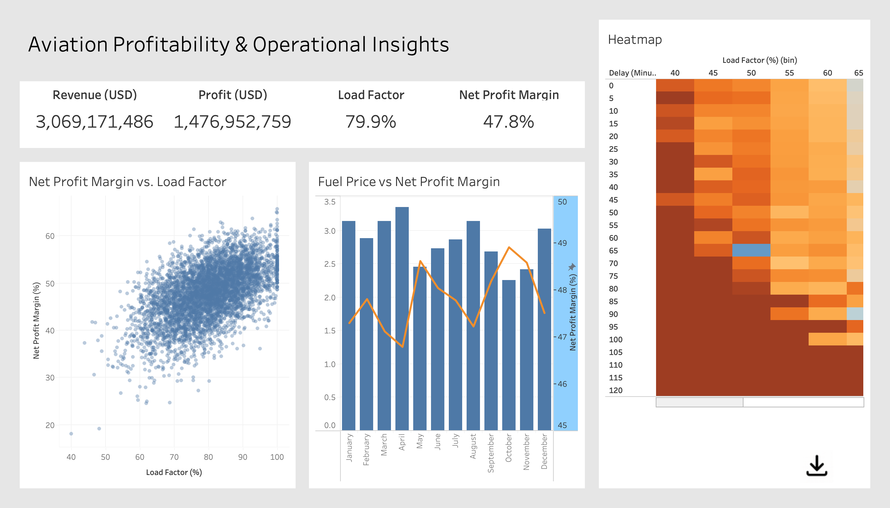
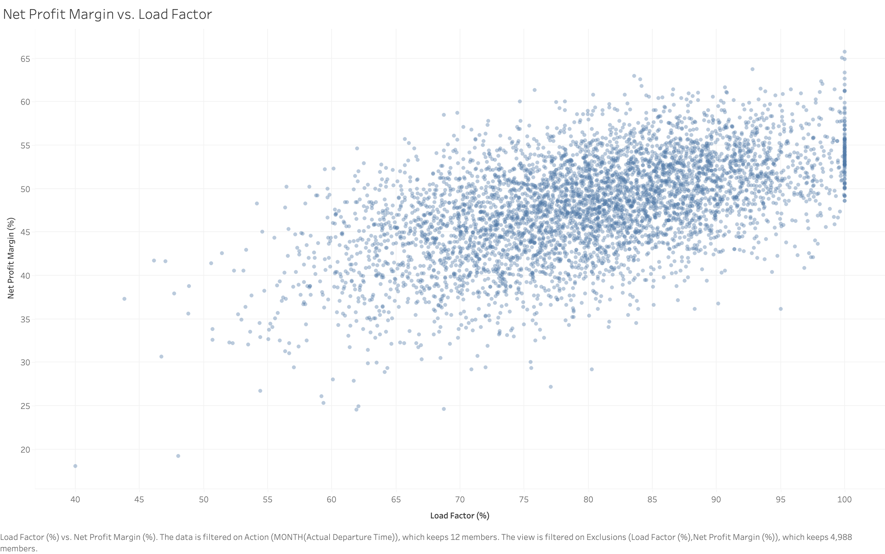
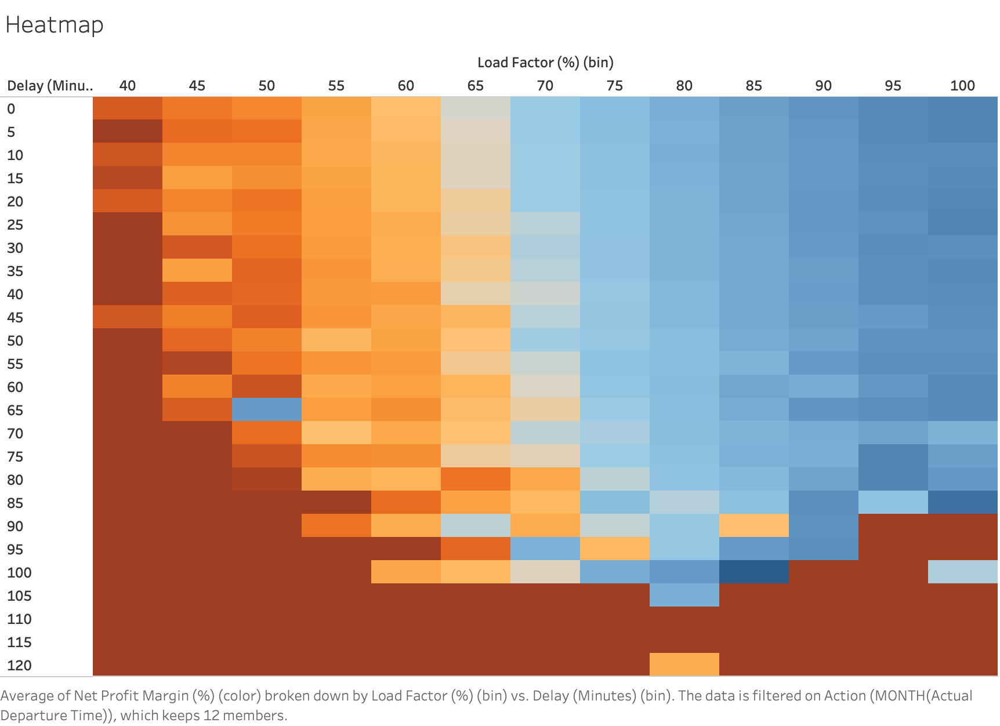
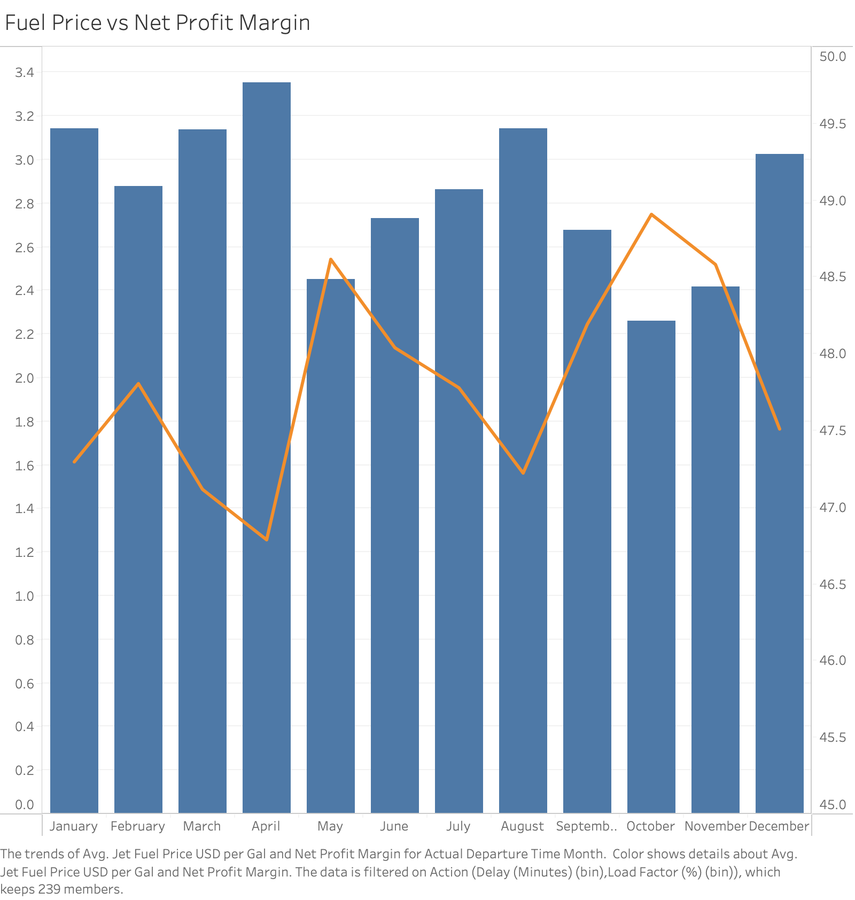

# Aviation Profitability & Operational Insights Dashboard

The dashboard that I created on Tableau summarizes operational and financial patterns across the dataset of 100,000+ simulated U.S. airline flights.

I used Tableau to create an interactive dashboard that helps visualize how Delays, Load Factor, Jet Fuel Prices, and monthly trends come together to show overall profitability. 

Key themes:
- **Operational Reliability** — Delays significantly reduce profit margins.  
- **Demand Efficiency** — Profitability increases sharply with higher load factors.  
- **Cost Sensitivity** — Fuel price fluctuations directly affect profit performance.
---

# Overview

This dataset is a simulation that was modeled for flight operations across major US airlines. Each record in the dataset represents a single flight with the realistic distributions for these columns: 

- **Load Factor (%)**
- **Net Profit Margin (%)**
- **Delay (Minutes)**
- **Operating Cost / Revenue**
- **Fuel Price**
- **Fleet Availability**
- **Maintenance Downtime**
- **Aircraft Utilization**
- **Turnaround Time**
- **ASK-based financial metrics**

The objective in this project was to find the depths of flight operations, see what drives profits in airlines, inefficiencies (what holds airline profitability back), and how operational behavior scales financially. 

## Project Goals

This project explores the operational and financial behavior of airlines through synthetic flight-level data.  
Key questions addressed:

- **What operational factors have the strongest impact on profitability?**
- **Is there a load factor “sweet spot” where profits peak?**
- **How do delays influence operating costs and margins?**
- **How sensitive are airlines to fuel price fluctuations?**
- **Which operational inefficiencies erode profitability the fastest?**

The goal is to simulate airline economics and understand how day-to-day operational behavior scales financially.

---

# Tableau Visualizations

### **1. Load Factor vs Net Profit Margin: Profitability Curve**

This scatterplot was to see where profit margin peaks, compared to load factor. The graph reveals that the profits increase as the load factor goes up, and especially increase sharply near **70-85% load factor**. The returns are diminishing near the **90%** mark. 
A scatterplot showing the “**sweet spot**” where profit margin peaks.  

---

### **2. Delay, Load Factor Heatmap**

The heatmap shows the relationship, showing that **higher delays lead to lower profit margins**. Also, we see that flights with low loads are very unprofitable when delayed, which is shown by the lumps of red near the bottom. 

Operational reliability directly impacts the margin in airlines.

---

### **3. Fuel Price vs Net Profit Margin (Monthly Trend)**

The dual-axis bar + line chart tracks the monthly fuel prices and the monthly average net profit margin. In this, we see that as fuel prices rise, the profit margin decreases. We also see that margins show a small recovery in months that have lower/stable fuel prices. This shows us how sensitive fuel costs are to the operations and profitability of airlines. 

Demonstrates the sensitivity of airline profitability to fuel costs.

 
---

# Python Modeling & Data Generation

This project includes a full Python-based simulation that models real-world airline operational and financial behavior.  
Instead of using a static airline dataset, I built a **custom generative model** in Python that uses statistical distributions to produce realistic flight-level data for U.S. airlines.

The purpose of this modeling step was to:
- Capture realistic operational patterns (delays, load factor, utilization)
- Build financial relationships (revenue, cost, margin)
- Study how operational behavior mathematically impacts profitability

---

## Modeling Approach

The dataset was generated using **NumPy**, **Pandas**, and statistical modeling to simulate:

### **1. Flight Schedule & Operational Stats**
- Randomized flight departure times over 12 months  
- Delays generated from a normal distribution and clipped at 0  
- Load factor modeled using a normal distribution centered around real U.S. airline averages (≈80%)  
- Aircraft utilization drawn from a distribution typical of mainline carriers (11–12 hours/day)  
- Turnaround time modeled with realistic variance (60–90 min)
- Fleet availability and maintenance downtime integrated to reflect reliability impacts

---

## **2. Fuel Price Modeling (Monthly)**  
Each month is assigned a randomized but realistic fuel price within **2.2–3.4 USD/gal**, simulating the typical volatility in jet fuel markets.  
Flights inherit the fuel price of their departure month.

This allows analysis of:
- month-over-month fuel cost trends  
- how volatile fuel price affects profit margin  

## Predictive Modeling (Python)

To complement the data visualizations, I also trained machine learning models to understand which operational factors most strongly influence airline profitability.

### Modeling Approach
I used **Random Forest** and **XGBoost** regressors on a cleaned subset of the dataset.  
New features were engineered from the flight timestamp (Month, Day, DayOfWeek), and numerical features were standardized before modeling.

### Results
Both models achieved **R² ≈ 0.998**, which is expected because the synthetic dataset defines:

**Profit Margin = (Revenue − Operating Cost) / Revenue**

This makes profitability almost perfectly predictable from revenue and cost.

### Key Drivers of Profitability
Feature importance analysis showed:

1. **Revenue (USD)**  
2. **Operating Cost (USD)**  
— These two dominate, since they directly define profit margin.

Secondary contributors include:
- Load Factor  
- Fleet Availability  
- Delays  
- Fuel Price  

### Takeaway
The predictive modeling confirms the financial logic built into the dataset:  
**Operational disruptions (delays, downtime, low utilization) influence profit, but financial metrics ultimately dominate airline profitability.**

## Tools & Technologies
- **Python (Pandas, NumPy, MatPlotLib)** — dataset creation and feature engineering  
- **Tableau** — dashboards and visual analytics  
- **GitHub** — project documentation and version control

